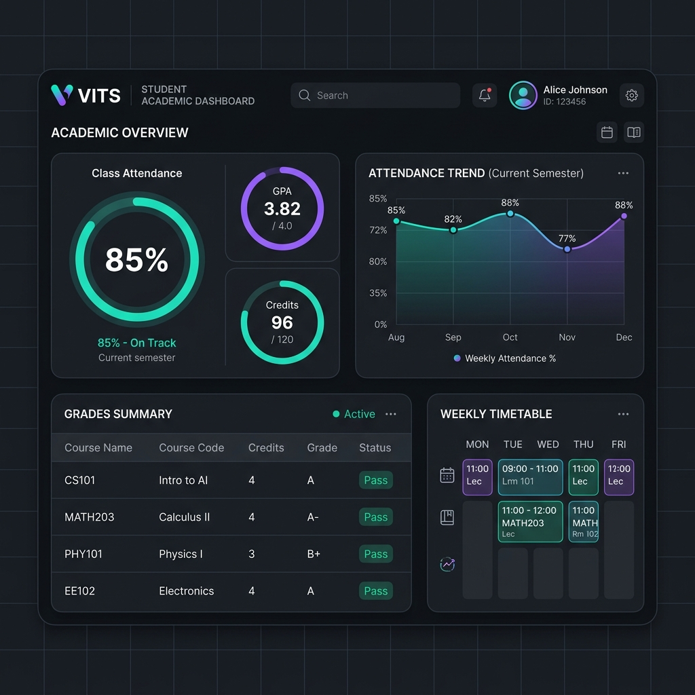

# 🎓 VITS Academic ERP Portal

A modern, fast, and feature-rich Academic ERP system built with Streamlit and Python. It offers a fully-responsive student academic dashboard and a secure administrator control console.

🌐 **Live Dashboard:** [vits-academic-dashboard.streamlit.app](https://vits-academic-dashboard.streamlit.app/)

---

## 📸 Dashboard Preview



---

## ✨ Key Features

### 👤 For Students
- **📈 Attendance Tracker & Analytics:** Real-time class attendance percentage, historical trend tracking, condonation planning, and monthly absent heatmaps.
- **🔮 Attendance Forecasts:** Smart estimation showing future attendance outcomes based on upcoming schedules.
- **📝 Marks & Grade Planner:** View exam marks (Mid 1, Mid 2, Lab Internals, Finals) and predict semester SGPA / overall CGPA with interactive sliders.
- **🗓️ Timetable Planner:** A clean timeline of daily classes and free periods tailored to the student's section.
- **⬇️ PDF Report Card:** Instantly generate and download official-looking semester report cards in PDF format.

### 🛡️ For Administrators
- **👥 Student Directory:** 
  - Manage student records, profiles, and sections.
  - **Reset Student Passwords:** One-click reset checkbox that resets a student's login credential back to the default setup password (`vits123`).
- **📝 Marks Editor:** Record or modify student grades for any course, semester, or exam type with validation bounds.
- **📤 CSV Upload Center:**
  - **Internal Marks CSV:** Bulk import mid-term scores and lab marks.
  - **JNTU Results CSV:** Import standard semester results with automatic SGPA calculations and student onboarding.
- **🔄 Scraper Harvester:** Scrape and sync active attendance records directly from the portal for single sections or bulk-scrape all classes.
- **💾 System Backups & Config:** Automatic database snapshots, active semester configurations, and secure admin password updates.

---

## 🛠️ Tech Stack
- **Frontend/Backend:** [Streamlit](https://streamlit.io/) (Python web framework)
- **Database:** SQLite (Local/Development) and PostgreSQL/Supabase (Production)
- **Charts:** [Plotly](https://plotly.com/) (Interactive data visualizations)
- **PDF Generation:** [ReportLab](https://www.reportlab.com/)

---

## 🚀 Getting Started (Local Run)

### 1. Clone the repository:
```bash
git clone https://github.com/Manideepvelchuri/vits-erp.git
cd vits-erp
```

### 2. Install dependencies:
```bash
pip install -r requirements.txt
```

### 3. Configure Database:
- By default, the application runs on a local SQLite database file `vits_erp.db` (auto-created on first run).
- To connect to a PostgreSQL database, set your connection URL in `.streamlit/secrets.toml` or as an environment variable:
```toml
[database]
url = "your-postgresql-connection-string"
```

### 4. Run the Streamlit application:
```bash
streamlit run streamlit_app.py
```
Open `http://localhost:8501` in your browser.

---

## 🔑 Default Credentials (First-Time Setup)
- **Student Default Login:** Use your Roll Number and default password: **`vits123`**. You will be prompted to set your Date of Birth as your permanent password on first-time login.
- **Admin Default Password:** `vits@admin123` (Configurable via Environment Variable `ADMIN_PASSWORD` or the Settings tab).
